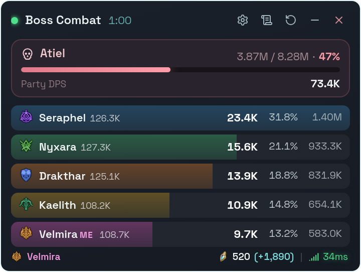
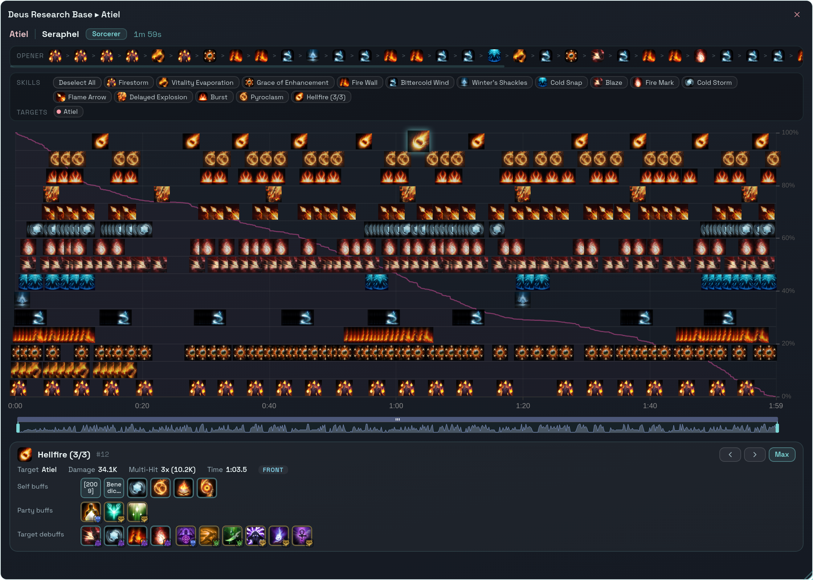
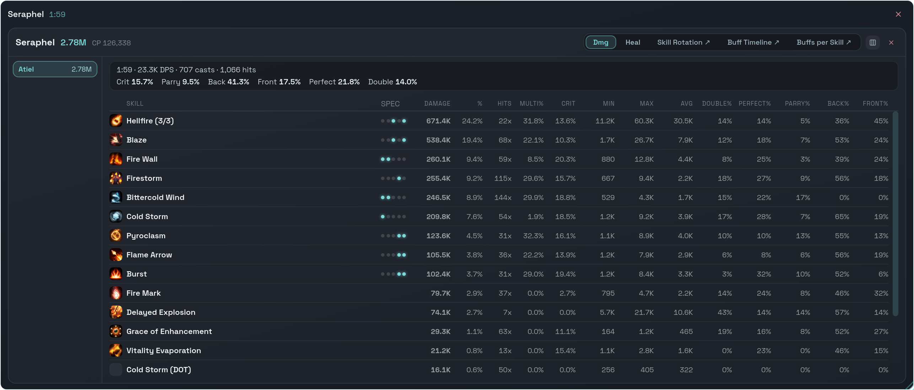
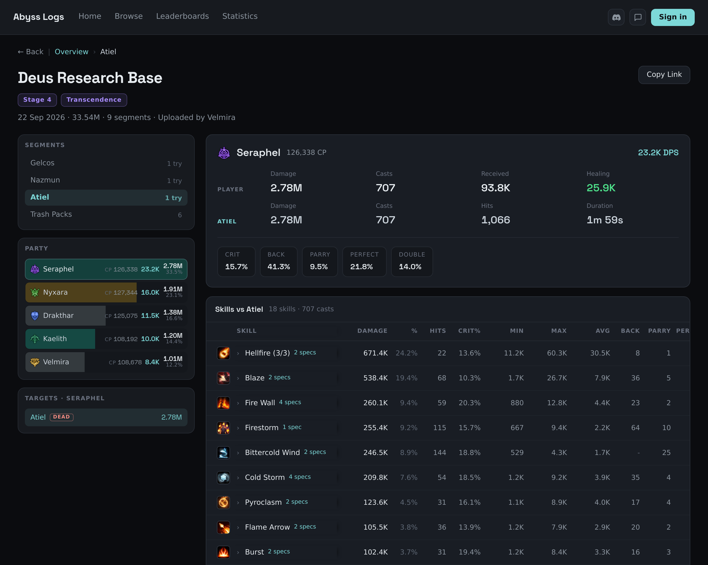
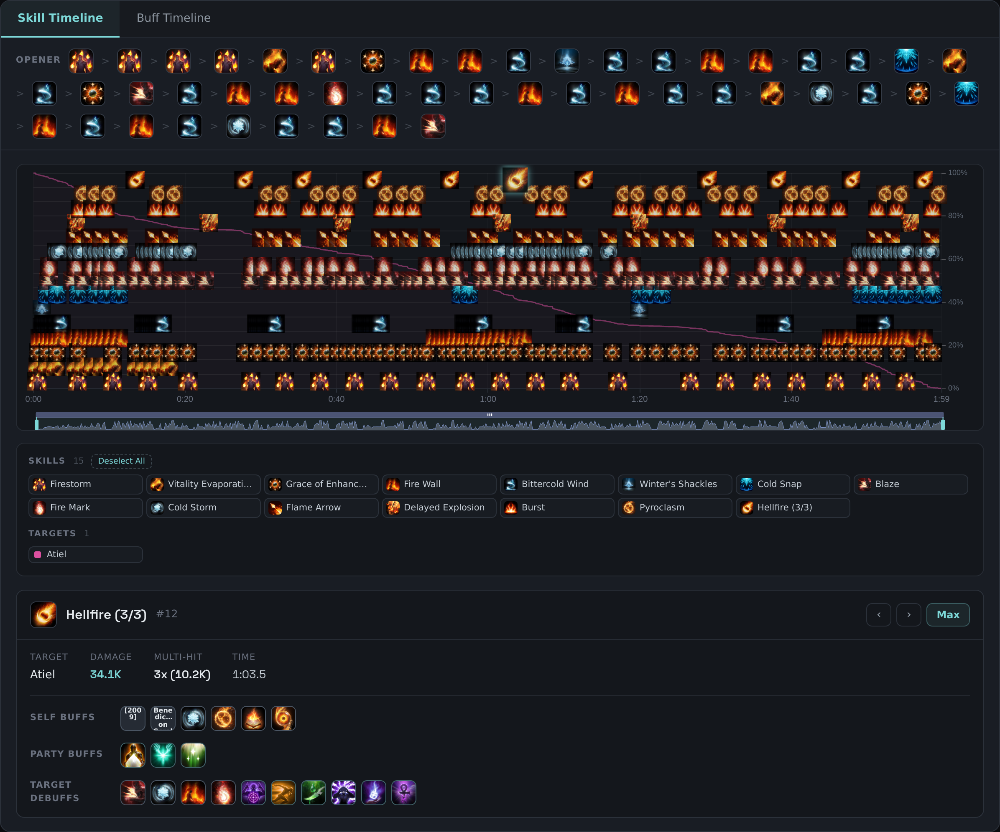
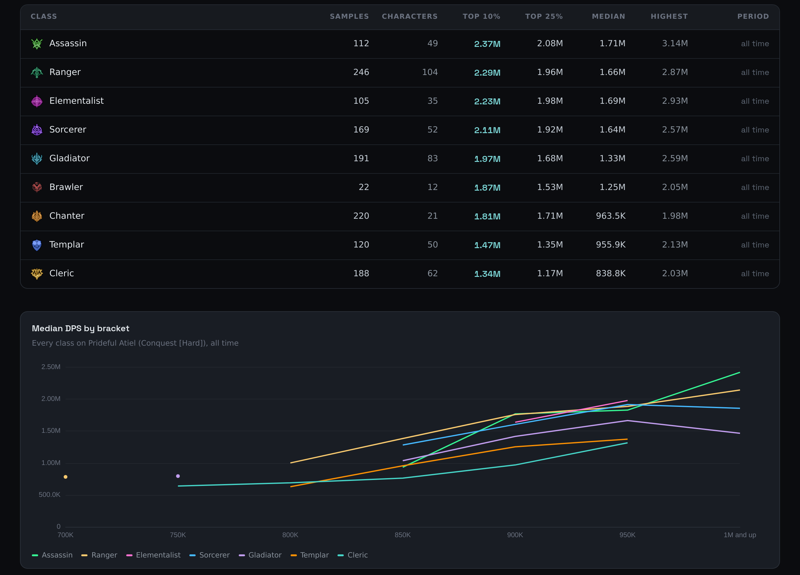

# Abyss Logs DPS Meter

**The Aion 2 DPS meter with shareable combat logs.**

Live overlay in game · one-click logs on abysslogs.com · all six regions · free

## What it does

**In game**

- **Live DPS bars** with class, combat power or gear score, and share of damage
- **Boss HP and party DPS** on the boss card
- **eDPS or aDPS**: the whole fight, or active time only
- **Player breakdown**: targets, skills, crit, back, front, parry, perfect, double and multi-hit rates
- **Skill Spy**: the specialities behind every skill
- **Heals** tracked on their own
- **Skill and buff timelines** against the boss's HP, with a player's opener sequence
- **Boss reset detection**: a wipe ends the fight, long mechanics do not idle
- **Training dummy parse capping** at 1, 2, 3 or 5 minutes
- **Dungeon lobby** with everyone's gear score, combat power and ready state
- **Fight history** on your PC, dungeon runs grouped, searchable by player and dungeon
- **Party only** and **boss only** capture
- **Hotkeys** to hide the overlay and reset the fight
- **Focus mode, opacity and UI scale** up to 200%
- **Footer** with your character, Odyle Energy and ping
- **Nine languages, six regions**, and it works through VPNs and ping reducers
- **One-click updates** with the changelog built in

**On [abysslogs.com](https://abysslogs.com)**

- One click in the meter uploads a fight or a whole dungeon run and copies its link.
- The full breakdown in the browser: party, skills, opener, skill and buff timelines.
- Leaderboards per region and boss, for verified characters only.
- Class statistics per boss by combat power bracket, and where your verified characters stand.
- The home page shows your region's newest fights, the top DPS on the hardest bosses being played and this week's DPS by class.
- Public, unlisted or private: you decide who sees each fight.

## Screenshots

<table>
  <tr>
    <td width="50%" valign="top"> In the meter: live DPS bars</td>
    <td width="50%" valign="top"> In the meter: the skill timeline against the boss's HP</td>
  </tr>
  <tr>
    <td colspan="2"> In the meter: one player's skills against the boss</td>
  </tr>
  <tr>
    <td width="50%" valign="top"> On abysslogs.com: the same fight, shared as part of its dungeon run</td>
    <td width="50%" valign="top"> On abysslogs.com: the same timeline and cast</td>
  </tr>
  <tr>
    <td colspan="2"> On abysslogs.com: class statistics per boss by combat power bracket</td>
  </tr>
</table>

## Get started

1. Install [Npcap](https://npcap.com/#download) and tick **Install Npcap in WinPcap API-compatible Mode**.
2. Download the meter from [abysslogs.com](https://abysslogs.com). It is a single `.exe` in a zip.
3. Run it. Windows asks for administrator rights, which packet capture needs.
4. Pick your region in **Settings → General**, then play.
5. To share fights, open **Settings → Account → Connect account** and approve the code in your browser. Dungeon runs then upload by themselves if you allow automatic uploads, and **Share** on any fight copies its link.

Updates install from inside the meter with one click.

## FAQ

**Is it free?**
Yes. Supporters on [Ko-fi](https://abysslogs.com/support) fund the servers and get 50 GB of storage for their fights instead of 2 GB.

**Can I get banned for using it?**
No. The meter passively reads game packets off the network interface. It does not modify, intercept or interact with the game client or server in any way.

**How accurate is it?**
The meter is 100% accurate. It records the game's own combat data, and the site never recalculates a number: what you see on the web is what the meter saw.

**Which systems does it run on?**
64-bit Windows.

---

Abyss Logs is an independent community project. Not affiliated with, endorsed by, or connected to NCSoft, NCWEST, or AION2 in any way.
